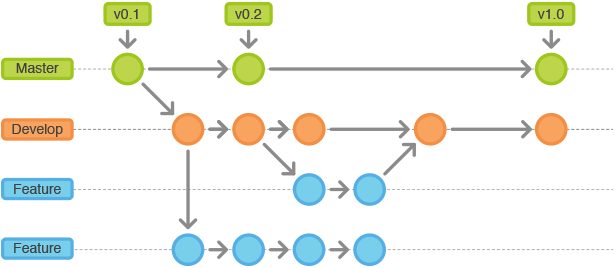

# Qual a importancia do git?

**O Git é essencial em quase todos os projetos realizados em equipes que geralmente trabalham em paralelo. Isso porque ele evita que haja conflitos entre as alterações realizadas. Como os projetos costumam estar em constante evolução, é comum ocorrer alterações que possam causar problemas no funcionamento deles.**

**Criador:Linus Torvals e Equipe**

## EXEMPLO DE VERSIONAMENTO COM O GIT 

## COMANDOS BASICOS:

- Git init
- Git Add
- Git commit -m "mensagem"
- Git push reporitorio 
- Git pull repositorio 
- Git fetch reporsitorio
- Git merge reporitorio-origem/na-branch  para-branch
- Git merge reporitorio-origem/na-branch  na-branch
- Git pullrequest
- Git status

