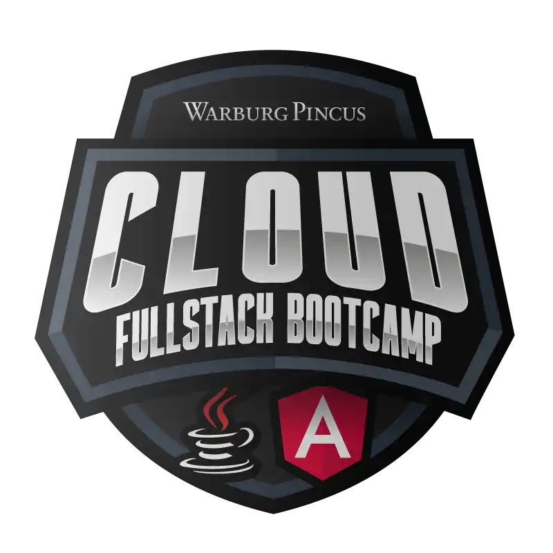
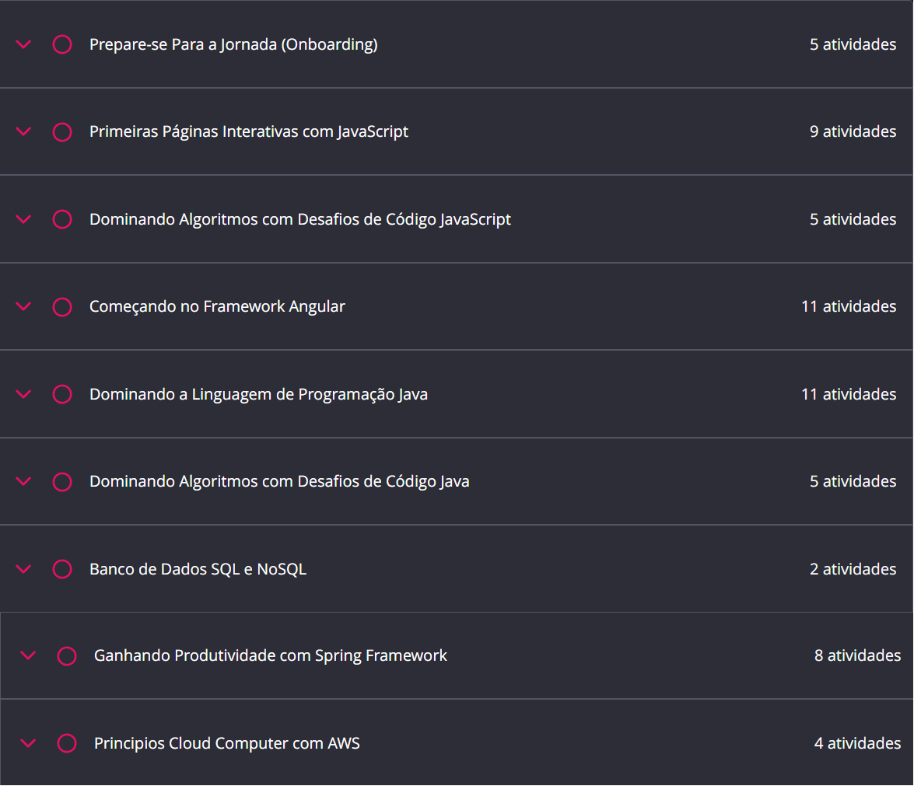

# Cloud Fullstack Bootcamp - Warburg Pincus

**Chegaram 7 novas empresas na DIO juntamente com uma trilha super completa em Fullstack com cloud! Se você quer começar na carreira de Fullstack ou está em busca de novas oportunidades, inscreva-se no Cloud Fullstack Bootcamp - Warburg Pincus, com 151 horas de experiência educacionais que abrangem as principais tecnologias para se tornar um(a) profissional Fullstack. Ao gerar a sua certificação, o seu perfil terá visibilidade para 6 grandes empresas, são elas: Warburg Pincus, Sólides, TakeBlip, Eleva Educação, Superlógica, Americanet e Blu.**

**BOOTCAMP NIVEL: Intermediario**

**CARGA HORARIA: 151h**

**CURSO DISPONIVEL: https://web.dio.me/track/cloud-fullstack-bootcamp-warburg-pincus**

## GRADE

